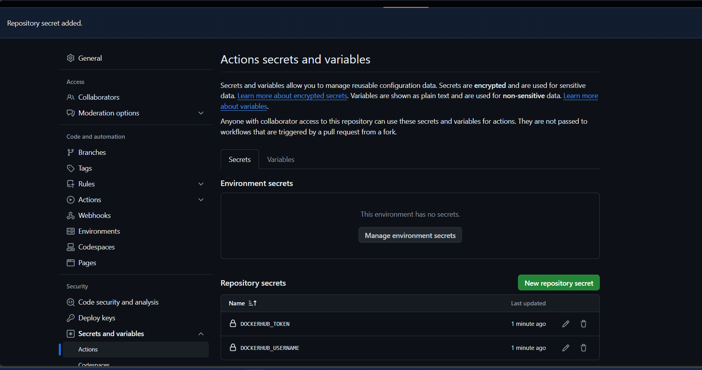

# Build Docker Images with GitHub Actions For My CV WebApp
## Automatically build Docker images with GitHub Actions


## Overview
This project demonstrates how to automatically build Docker images using GitHub Actions. By integrating Docker and GitHub Actions, DevOps engineers can create a seamless **CI/CD (Continuous Integration/Continuous Deployment)** pipeline for projects, ensuring that Docker images are built and pushed to a registry whenever changes are made by developers to the codebase.

## Step-by-Step Process

### 1. Wep Application Development
I developed the web application with the DotNet (.NET) SDK framework which is programmed in C# languaue. 

### 2. Create a GitHub Repository
Begin by creating a new GitHub repository for your project. This will be the central location for your code, configurations, and the GitHub Actions workflow.<p>
1. Open a new terminal in VScode.
2. Create a directory with a repo name you desire (named mine `Deploy-Webapp-with-Kubernetes`).
3. Initialise directory by running:
```
git init
```
4. Use **HuB** to change the local directory to a remote repo. Run:
```
hub create
```
5. Optional: Add README.md (but recommended).
```
echo "## Automatically build Docker images with GitHub Actions" >> README.md
```
6. Push the new repo to GitHub.
```
git add README.md
git commit -m "first commit"
git branch -M main
git push -u origin main
```
if you do not have Hub installed, manually create a github repo and run this command in the terminal:
```
git remote add origin https://github.com/<github-username>/<repo-name>.git
```
For step by step process of creating a github repo from thr terminal, check this [project](https://github.com/JonesKwameOsei/Deploy-Webapp-with-Kubernetes)

### 2. Set Up Dockerfile:
Create a `Dockerfile` in the root directory of your `ASP.NET` web application. 
- Create a file called Dockerfile.
```
nano Dockerfile
```
- Add these lines of codes:
```
#See https://aka.ms/customizecontainer to learn how to customize your debug container and how Visual Studio uses this Dockerfile to build your images for faster debugging.

FROM mcr.microsoft.com/dotnet/aspnet:8.0 AS base
USER app
WORKDIR /app
EXPOSE 8080
EXPOSE 8081

FROM mcr.microsoft.com/dotnet/sdk:8.0 AS build
ARG BUILD_CONFIGURATION=Release
WORKDIR /src
COPY ["myWebCVApp/myWebCVApp.csproj", "myWebCVApp/"]
RUN dotnet restore "./myWebCVApp/myWebCVApp.csproj"
COPY . .
WORKDIR "/src/myWebCVApp"
RUN dotnet build "./myWebCVApp.csproj" -c $BUILD_CONFIGURATION -o /app/build

FROM build AS publish
ARG BUILD_CONFIGURATION=Release
RUN dotnet publish "./myWebCVApp.csproj" -c $BUILD_CONFIGURATION -o /app/publish /p:UseAppHost=false

FROM base AS final
WORKDIR /app
COPY --from=publish /app/publish .
ENTRYPOINT ["dotnet", "myWebCVApp.dll"]

```
- Perform the steps above to create and add the lines below to the myWebCVApp.csproj.
```
<Project Sdk="Microsoft.NET.Sdk.Web">

  <PropertyGroup>
    <TargetFramework>net8.0</TargetFramework>
    <Nullable>enable</Nullable>
    <ImplicitUsings>enable</ImplicitUsings>
    <UserSecretsId>2f4575b4-591c-4e4f-9ba0-9892f29c50ae</UserSecretsId>
    <DockerDefaultTargetOS>Linux</DockerDefaultTargetOS>
  </PropertyGroup>

  <ItemGroup>
    <PackageReference Include="Microsoft.VisualStudio.Azure.Containers.Tools.Targets" Version="1.20.1" />
  </ItemGroup>

</Project>
```
### 3. Set up the Docker Build Workflow
In the GitHub repository, create a new folder named `.github/workflows`. This is where the GitHub Actions workflow is defined.

Inside the `workflows` folder, create a new file named `dockerhub-push.yml`. This file will contain the configuration for the Docker build workflow.

```
name: Dockerise and Push Docker image CI

on:
  push:
    branches:
      - main

jobs:
  build:
    runs-on: ubuntu-latest

    steps:
      - name: Checkout code
        uses: actions/checkout@v2

      - name: Set up Docker Buildx
        uses: docker/setup-buildx-action@v1

      - name: Login to Docker Hub
        uses: docker/login-action@v1
        with:
          username: ${{ secrets.DOCKER_USERNAME }}
          password: ${{ secrets.DOCKER_PASSWORD }}

      - name: Build and push Docker image
        uses: docker/build-push-action@v2
        with:
          context: .
          push: true
          tags: kwameds/mycvwebapp:1.0.0
```

This workflow will be triggered on push and pull request events to the `main` branch. It performs the following steps:

1. Checks out the repository code.
2. Sets up the Docker Buildx environment for multi-architecture builds.
3. Logs in to the GitHub Container Registry (ghcr.io) using the `GITHUB_TOKEN` secret.
4. Builds the Docker image and pushes it to the GitHub Container Registry, tagging it with the current commit SHA.

### 4. Generate Docker Hub Access Token
The need for a Docker Hub access token when using GitHub Actions to build and push Docker images is related to authentication and authorization.
When you want to push a Docker image to a registry, such as Docker Hub, the registry needs to verify that you have the necessary permissions to do so. This is where the access token comes into play.
Here are the key reasons why you need a Docker Hub access token for GitHub Actions:

1. **Authentication**: The access token acts as a credential that authenticates your GitHub Actions workflow with Docker Hub. Without the token, the workflow would not be able to prove its identity to the registry and gain access to push the image.

2. **Authorization**: The access token grants the necessary permissions to your GitHub Actions workflow to push the Docker image to your specific Docker Hub account or organization. This ensures that only authorized parties can push images to the designated registry location.

3. **Security**: Using an access token is more secure than hardcoding your Docker Hub username and password directly in your GitHub Actions workflow. Access tokens can be managed and revoked separately, providing better control and security over your credentials.

By providing the Docker Hub access token as a secret in the GitHub Actions workflow, we can securely authenticate your workflow and grant it the required permissions to push the Docker image to the desired registry location on Docker Hub.

This approach is a best practice for managing credentials in the CI/CD pipelines, as it separates the sensitive information from the workflow code and ensures better security and maintainability of the build and deployment processes.
- In `Docker Hub`, click on the `Docker Hub Profile` on the top right corner.<p>
<p>
- Select `My Account `.
- Select `Security`.<p>
<p>
- Click the `New Access Token` button.<p>
<p>
- In the `Access Token Description` field, enter a description `GithubAction` for the token.<p>
<p>
- Leave the next field as default and click `Generate Token`.
- Copy the token generated and close the pane. <p>
<p>

### 5. Store Secrets in Github Actions
1. In the Github repo, click on settings.
2. On the left silde, find `Secrets and Variables`, click the dropdown and select `Actions`.
<p>
3. Under the `Repository secrets`, click on the green button, `New repository Secret`.
4. For `Name` and `Secret`, enter details of the following:<p>

|Name|Secret|
|----|------|
|DOKERHUB_USERNAME|Your docker username|
|DOKERHUB_TOKEN|The access token generated|<p>

The configuration should look like this:<p>
<p>

### 6. Manually build and Push the Docker Image Locally
Open a terminal, navigate to the directory containing the Dockerfile, and build the Docker image.
```
docker build -t kwameds/mycvwebapp:1.0.0 .
```
Image is built:<p>
```
[+] Building 569.1s (18/18) FINISHED                                docker:default
 => [internal] load build definition from Dockerfile                          0.1s
 => => transferring dockerfile: 904B                                          0.0s 
 => [internal] load metadata for mcr.microsoft.com/dotnet/sdk:8.0             1.0s 
 => [internal] load metadata for mcr.microsoft.com/dotnet/aspnet:8.0          0.9s 
 => [internal] load .dockerignore                                             0.0s
 => => transferring context: 464B                                             0.0s 
 => [build 1/7] FROM mcr.microsoft.com/dotnet/sdk:8.0@sha256:1e0c55b0ae732  554.6s 
 => => resolve mcr.microsoft.com/dotnet/sdk:8.0@sha256:1e0c55b0ae732f333818f  0.0s
 => => sha256:4369f7f50afbe743842fb8431f68ba4c280217854a4 15.73MB / 15.73MB  53.8s 
 => => sha256:9cca61ea7dcde9e148fce1ff995332d2ad533b2d 183.59MB / 183.59MB  472.2s 
 => => sha256:843791b459d2398954cec1204e9d601346fcc7793fc 30.69MB / 30.69MB  83.2s 
 => => extracting sha256:843791b459d2398954cec1204e9d601346fcc7793fcbc522033  0.6s 
 => => extracting sha256:9cca61ea7dcde9e148fce1ff995332d2ad533b2d4c5927d344d  2.5s 
 => => extracting sha256:4369f7f50afbe743842fb8431f68ba4c280217854a444db13a5  0.3s 
 => [base 1/2] FROM mcr.microsoft.com/dotnet/aspnet:8.0@sha256:a22d22bcedc  105.5s 
 => => resolve mcr.microsoft.com/dotnet/aspnet:8.0@sha256:a22d22bcedc67df31b  0.0s 
 => => sha256:026220c9919398c3ac236b91cbf15c448fb5383eed7 11.03MB / 11.03MB  37.4s 
 => => sha256:fb5d00a9ff0e9f7f92e11503fbbdf16143ca63c8c357d82841 153B / 153B  0.8s 
 => => sha256:4ede38c3f6aeccac1e49f0cee1f685968f6502c801 32.23MB / 32.23MB  104.7s 
 => => sha256:cc7f450a69e27d8e92017b26b10f914c0adbde22f39dea 3.28kB / 3.28kB  1.0s 
 => => sha256:09f376ebb190216b0459f470e71bec7b5dfa611d66b 29.15MB / 29.15MB  88.8s 
 => => sha256:898e6be7b1d63a481b0a404455fe5b3c65450c37074 18.52MB / 18.52MB  78.2s 
 => => extracting sha256:09f376ebb190216b0459f470e71bec7b5dfa611d66bf008492b  0.7s 
 => => extracting sha256:898e6be7b1d63a481b0a404455fe5b3c65450c37074a0e386d3  0.3s 
 => => extracting sha256:cc7f450a69e27d8e92017b26b10f914c0adbde22f39dead838e  0.0s 
 => => extracting sha256:4ede38c3f6aeccac1e49f0cee1f685968f6502c801605dd4538  0.4s 
 => => extracting sha256:fb5d00a9ff0e9f7f92e11503fbbdf16143ca63c8c357d828412  0.0s 
 => => extracting sha256:026220c9919398c3ac236b91cbf15c448fb5383eed772379acf  0.1s 
 => [internal] load build context                                             0.8s 
 => => transferring context: 16.63MB                                          0.7s 
 => [base 2/2] WORKDIR /app                                                   0.6s 
 => [final 1/2] WORKDIR /app                                                  0.0s 
 => [build 2/7] WORKDIR /src                                                  1.1s 
 => [build 3/7] COPY [myWebCVApp/myWebCVApp.csproj, myWebCVApp/]              0.0s 
 => [build 4/7] RUN dotnet restore "./myWebCVApp/myWebCVApp.csproj"           3.9s 
 => [build 5/7] COPY . .                                                      0.1s 
 => [build 6/7] WORKDIR /src/myWebCVApp                                       0.0s 
 => [build 7/7] RUN dotnet build "./myWebCVApp.csproj" -c Release -o /app/bu  5.2s 
 => [publish 1/1] RUN dotnet publish "./myWebCVApp.csproj" -c Release -o /ap  2.1s 
 => [final 2/2] COPY --from=publish /app/publish .                            0.1s 
 => exporting to image                                                        0.5s 
 => => exporting layers                                                       0.4s 
 => => exporting manifest sha256:458dae421596fdd372d413e651b829acb1d3eeb93ae  0.0s 
 => => exporting config sha256:76ef9ba27503224cac6394aabcde92b83d56fc04a9605  0.0s 
 => => exporting attestation manifest sha256:23aa0b687d5e7b874cb8e3b9d312acc  0.0s 
 => => exporting manifest list sha256:26af15f605adebd95eae2e82c44b8919e151ef  0.0s 
 => => naming to docker.io/kwameds/mycvwebapp:1.0.0                           0.0s 
 => => unpacking to docker.io/kwameds/mycvwebapp:1.0.0                        0.1s 

View build details: docker-desktop://dashboard/build/default/default/hcmeaq9cb3mq23pliwjm1o0z9

What's Next?
  View a summary of image vulnerabilities and recommendations → docker scout quickview
```
We can verify from on Docker CLI if the image is actually built. To do this, run:
```
docker images
```
<p>
Verification from Docker Desktop:<p>
<p>

Next, we will run the Docker Image Locally. This is to test the image locally to ensure it works correctly.
```
docker run -d -p -- name mycvwebapp 8080:8080 kwameds/mycvwebapp:1.0.0
```
The application access at http://localhost:8080.<p>
<p>
The `Home Page` is live:<p>
<p>
The **CV** page can be viewed when a user clicks on the `CV` tab at the top:<p>
<p>

It will be good to push this image to my docker hub repository so that we can compare this image to the one built with automation - GitHub actions pipeline. <p>
I will log into my Docker Hub account from the terminal.
```
docker login
```
Then push the image to Docker Hub:<p>
```
docker push kwameds/mycvwebapp:1.0.0
```
<p>
Imaged has been pushed successfully.<p>
<p>
Let us get a confirmation from Docker Hub. <p>
<p>
<p>
<p>


### 6. Run the GitHub Actions Workflow

2. Add the changes and commit
```
git add .
git commit -m "Added configuration files"
```
3. Push the commit to trigger the actions
```
git push origin main
```
Commit and push the changes to the `main` branch of your GitHub repository. This will trigger the `docker-build.yml` workflow, which will automatically build and push your Docker image to the GitHub Container Registry.In the "Actions" tab of the GitHub repository, we can monitor the progress and check the status of the workflow run.<p>

The pipeline actions has been executed:<p>
<p>
<p>
<p>
<p>

GitHub action completed. We will confirm if the the image is in the `Docker Hub` registry. 
<p>
Image in docker hub.<p>
<p>
<p>

## Conclusion
In this project, I have demonstrated how to utilised continuous integration in the software development circle. I also leveraged on my programming abilities to develop my web application with `Microsoft .NET SDK` written in `C#`. This was done with `Microsoft Visual Studio`. I have seamlessly integrated Docker into a development pipeline. This approach allow **DevOps Enginees** to automatically build and push Docker images to a registry, ensuring that the deployments are consistent and up-to-date with the latest changes to the codebase. This setup provides a reliable and efficient way to manage the Docker-based applications.
